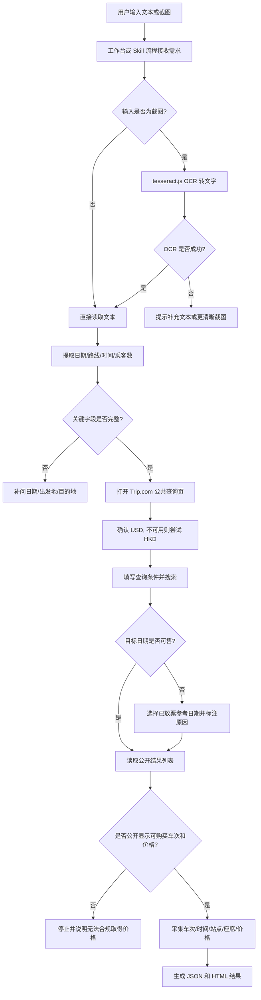

# Arrange Schedule Skill 项目

本项目是一个面向 ReoTrip 实习任务的 Codex Skill 交付包，用于识别日本新干线查价需求，并在合规边界内查询公开页面展示的车次和价格信息。

当前正式交付目录为：

```text
03_实习生提交/shinkansen-price-skill/
```

## 项目目标

- 从客户文本或截图中识别行程需求。
- 提取日期、出发地、目的地、期望时间和乘客人数。
- 优先通过 Trip.com 公共页面查询新干线车次和公开展示价格。
- 生成结构化 JSON 和 HTML 结果，方便核查与展示。
- 在目标日期未开售时，使用已放票日期作为参考，并明确标注参考原因。
- 保持只读安全边界，不登录、不下单、不锁票、不支付。

## 目录结构

```text
arrange schedule skill/
├── 01_任务说明/
│   └── 新干线车票价格查询Skill任务说明.md
├── 02_参考资料/
│   ├── 参考链接.md
│   ├── 测试样例.md
│   └── 截图样例/
├── 03_实习生提交/
│   └── shinkansen-price-skill/
│       ├── SKILL.md
│       ├── README.md
│       ├── package.json
│       ├── pnpm-lock.yaml
│       ├── agents/
│       ├── assets/
│       ├── examples/
│       └── scripts/
├── 04_过程记录/
├── docs/
│   └── arrange-schedule-skill-flow.md
├── 项目结构说明.md
├── README.md
└── .gitignore
```

## 核心链路图

完整 Mermaid 链路图见：[docs/arrange-schedule-skill-flow.md](docs/arrange-schedule-skill-flow.md)



## 正式 Skill 说明

Skill 主文件：

```text
03_实习生提交/shinkansen-price-skill/SKILL.md
```

它定义了：

- 使用场景
- 字段提取规则
- 站点名称标准化规则
- Trip.com 查询流程
- 未开售日期处理规则
- 输出格式
- 失败响应
- 安全检查清单

## 主要脚本

| 文件 | 作用 |
| --- | --- |
| `scripts/request_workbench_server.cjs` | 启动本地 HTML 工作台，提供文本输入、截图上传、字段提取和查询接口 |
| `scripts/tripcom_select_request.cjs` | Trip.com 主自动化脚本，负责字段提取、页面查询、结果采集和报告生成 |
| `scripts/open_klook_public_page.cjs` | 打开 Klook 公共页面做访问探测，不进入下单或价格采集流程 |
| `scripts/extract_request.py` | Python 字段提取辅助脚本 |
| `scripts/open_tripcom.py` | 构造或打开 Trip.com 查询入口 |
| `scripts/parse_tripcom_details.py` | 解析 Trip.com 结果文本或浏览器结果 |
| `scripts/request_workbench_server.cjs` | 将查询结果写入 `examples/workbench-runs/` |

## 安装依赖

进入正式 Skill 目录：

```powershell
cd "D:\常用文件\reotrip\arrange schedule skill\03_实习生提交\shinkansen-price-skill"
pnpm install
```

`package.json` 中声明了 `tesseract.js`，用于截图 OCR。Playwright 通常由 Codex 运行环境提供；如果在普通 Node 环境运行，需要额外安装 Playwright。

## 启动本地工作台

```powershell
node scripts/request_workbench_server.cjs
```

默认访问：

```text
http://127.0.0.1:8787/
```

工作台接口：

| 路径 | 方法 | 说明 |
| --- | --- | --- |
| `/` | GET | 打开 HTML 工作台 |
| `/api/extract` | POST | 仅做需求字段提取 |
| `/api/query` | POST | 执行查询并生成 JSON/HTML 报告 |
| `/reports/<file>` | GET | 查看生成的 HTML 报告 |

## 命令行查询示例

```powershell
node scripts/tripcom_select_request.cjs `
  --text "客人 2 位成人，想在 2026 年 7 月 25 日下午从东京去京都，优先看可预订的新干线车次。" `
  --output "examples/trip-selection-result.json" `
  --html-output "examples/trip-selection-result.html"
```

## 输出物

- JSON：保存识别字段、查询参数、车次和价格结果。
- HTML：保存面向核查和展示的可视化结果。
- 测试记录：`03_实习生提交/shinkansen-price-skill/测试记录.md`
- 交付说明：`03_实习生提交/shinkansen-price-skill/交付说明.md`

## 安全边界

本项目只做公开页面只读查价：

- 不登录账号
- 不加入购物车
- 不点击会锁票、占座、生成订单的按钮
- 不填写乘客信息
- 不提交订单
- 不进入支付流程
- 不绕过验证码、风控、地区限制或访问控制
- 不进行高频批量请求

如果价格必须进入下单或锁票流程后才能看到，脚本必须停止并说明无法在合规边界内取得价格。

## Git 忽略说明

仓库已排除：

- `node_modules/`
- OCR 和运行缓存
- Python `__pycache__`
- 生成的 workbench 运行结果
- 测试运行临时目录
- zip/rar/7z 交付压缩包
- 旧版本解压副本
- 本地编辑器和系统文件

这样仓库只保留任务说明、参考资料、当前正式 Skill 源码、过程记录和配套文档。
