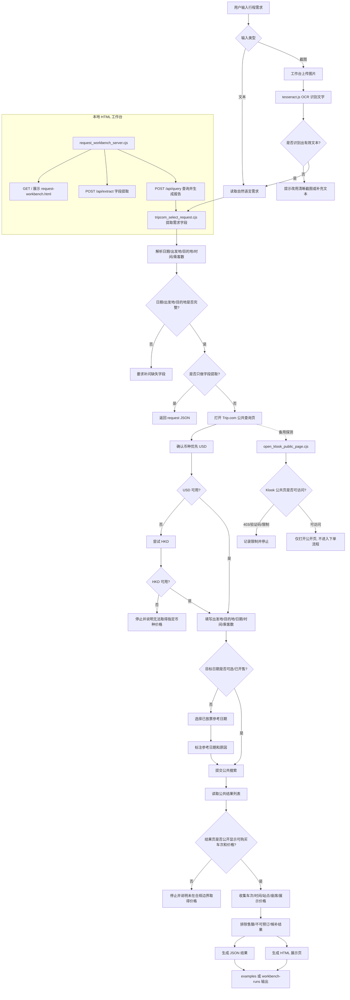

# Arrange Schedule Skill 链路图

## 链路说明

- `SKILL.md` 定义使用边界：只读查价，不登录、不下单、不锁票、不支付。
- `scripts/request_workbench_server.cjs` 提供本地 HTML 工作台，支持文本输入和截图 OCR。
- `scripts/tripcom_select_request.cjs` 是当前主要自动化链路，负责字段提取、Trip.com 页面操作、结果采集和报告生成。
- `scripts/open_klook_public_page.cjs` 只用于 Klook 公共页访问探测，当前不作为稳定查价结果来源。
- 输出结果会写为 JSON 和 HTML，便于复核、展示和交付。
