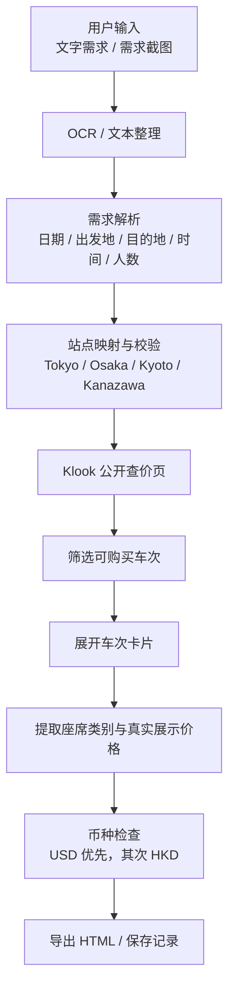

# 新干线车票价格查询 Skill

这是一个用于从文字或截图中提取新干线查价需求，并在 Klook 公开页面读取可售车次与真实展示价格的浏览器插件项目。

## 核心链路



链路图的独立版本见：[docs/链路图.md](docs/%E9%93%BE%E8%B7%AF%E5%9B%BE.md)

## 使用方式

1. 打开 Chrome 或 Edge 的扩展管理页。
2. 开启开发者模式。
3. 选择“加载已解压的扩展”，加载本目录下的 `browser-extension` 文件夹。
4. 打开 Klook 日本铁路查价页面。
5. 在插件中粘贴文字或上传需求截图，点击 `Extract fields`。
6. 插件会自动填写路线、日期和时间，并尝试展开符合条件的车次。
7. 查询完成后会导出 HTML 结果，也可以点击 `Export train HTML` 再导出一次。

## 输出内容

正式结果只保留这些信息：

- 出发时间
- 到达时间
- 出发站
- 到达站
- 列车类型或车次
- 坐席类别
- 真实展示价格

不会把整页网页内容作为正式结果展示。

## 当前实现范围

- 稳定支持：Klook 日本铁路公开查价页面。
- Trip.com：保留为参考渠道，当前未做稳定自动操作。
- 价格：只复制页面真实展示价格，不做换算或推算。
- 币种：优先 USD，其次 HKD；如果页面没有这两种币种，会如实说明。
- 未开售日期：仍需要人工确认参考日期，插件不把推测价格当作目标日期真实价格。
- 安全边界：不登录、不下单、不锁票、不填写乘客资料、不支付。

## 项目结构

```text
shinkansen-price-skill/
├─ SKILL.md
├─ README.md
├─ docs/
│  └─ 链路图.md
├─ examples/
│  ├─ sample-inputs.md
│  ├─ sample-output.md
│  └─ test-cases.md
├─ browser-extension/
│  ├─ manifest.json
│  ├─ popup.html
│  ├─ popup.js
│  ├─ content.js
│  └─ vendor/
├─ 测试记录.md
├─ 交付说明.md
└─ 使用说明.md
```

## 忽略文件

仓库已通过 `.gitignore` 排除了压缩包、`node_modules/`、日志、临时文件和常见编辑器缓存文件，避免把不需要的生成物带进版本库。
