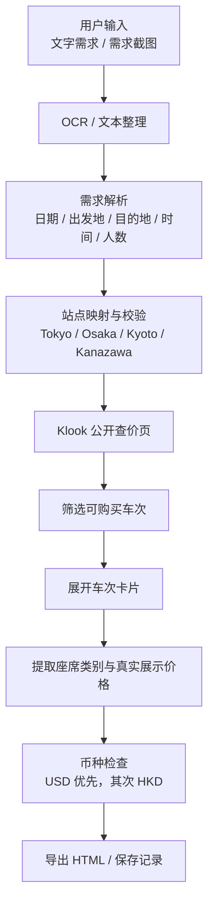

# 新干线车票价格查询 Skill 链路图

```mermaid
flowchart TD
  A[用户输入<br/>文字需求 / 需求截图] --> B[OCR / 文本整理]
  B --> C[需求解析<br/>日期 / 出发地 / 目的地 / 时间 / 人数]
  C --> D[站点映射与校验<br/>Tokyo / Osaka / Kyoto / Kanazawa]
  D --> E[Klook 公开查价页]
  E --> F[筛选可购买车次]
  F --> G[展开车次卡片]
  G --> H[提取座席类别与真实展示价格]
  H --> I[币种检查<br/>USD 优先，其次 HKD]
  I --> J[导出 HTML / 保存记录]
```

## 说明

1. 输入可以是文字，也可以是截图。
2. 中间流程负责识别需求、填写页面、筛选车次和读取价格。
3. 输出只保留真实展示的车次信息，不包含下单、支付或其他敏感操作。
