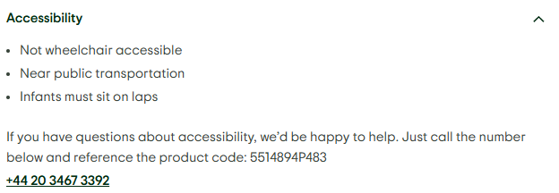

# viator企业位置

viator后台：https://supplier\.viator\.com/products/

tripadviser：https://www\.tripadvisor\.co\.uk/

Tripadviser reotrip搜索结果：https://www\.tripadvisor\.co\.uk/Search?q=reotrip\&searchNearby=false\&searchSessionId=000f58fa85b3f1c3\.ssid

## 前期提要：

爬取viator后台和tripadviser时让grok控制爬取速度，以及拉取方式不要太暴力。

不要执行可能触发风控，被识别异常风险的操作。

安全缓步获取信息。太暴力可能会被封ip

要求获取的数据内容比较多，而且涉及后续多次任务结果的比较。需要让grok整理好项目目录。

viator爬取结果xlsx，tripadviser爬取结果xlsx需要分开文件夹存放，文件名需要体现版本和爬取时间，便于一眼识别区分。

### 任务流程：

1. 筛选viator当前已上线的产品，获取已上线产品列表，以及已上线产品的企业位置。

2. 去tripadviser检索viator已上线产品是否透传到tripadviser。如果已透传，tripadviser可以检索到该产品，且产品code和后台code一致。除透传状态外，还需记录其tripadviser评分

3. 确认下tripadviser里记录了哪些reotrip企业位置，以及其tripadviser评分

4. 获取每个企业位置的网页链接，以及其下的展示的产品数量，具体展示的产品以及产品评分

5. 后续需要执行需要对比前后版本的viator产品透传状态，tripadviser企业位置下产品展示情况，产品和企业位置评分变动情况。具体变动情况需要显著体现在输出xlsx里，这点交给grok看下怎么做。

交付：

一份可复用的操作skill，交给grok执行即可完成上述操作。
注意：后续需要执行需要对比前后版本的viator产品透传状态，tripadviser企业位置下产品展示情况，产品和企业位置评分等变动情况。

两份xlsx：

一份以viator后台视角，展示已上线产品，产品code，viator产品评分和tripadviser透传状态

一份以tripadviser视角，展示tripadviser已记录的企业位置及其评分，每个企业位置下展示的产品及其评分状态。

