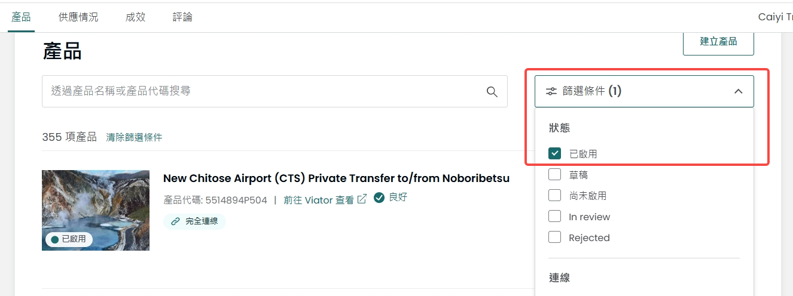

# Viator任务

## 任务所需链接：

viator后台链接：https://supplier\.viator\.com/products/

携程供应商链接：https://travelagents\.trip\.com/ttddist/unityList/all

klook供应商链接：https://klook\.klktech\.com/search?keyword=heaven\&\_=1787102816907

viator已上线产品列表：[Viator已上线产品列表](https://zcn93midtks7.feishu.cn/wiki/IvwNwZS5IiP6xEkjSzPcOYNTnXb?sheet=f582c1)

## 前情提要

爬取viator后台和供应链时让grok控制爬取速度，以及拉取方式不要太暴力。

不要执行可能触发风控，被识别异常风险的操作。

安全缓步获取信息。太暴力可能会被供应链警告。

### 任务流程：

筛选viator已上线的产品

让grok爬取viator已上线产品列表，用一个xlsx文件存放，分三个表存放。

三个表分别为：门票产品，纯接送产品。包车产品，日游产品

注意下：
门票产品类型包含：单门票产品，门票\+接送产品，门票组合产品（比如景区门票\+地铁票）

包车产品：option按车型\+纯司机，车型\+司机\&导游类型卖的是包车产品，不属于日游产品。

日游产品：目前日游产品主要是途益的bus tour，option一般是集合地点。

各产品的任务目标：

先看下[Viator已上线产品列表](https://zcn93midtks7.feishu.cn/wiki/IvwNwZS5IiP6xEkjSzPcOYNTnXb?sheet=f582c1)这里门票产品的例子：
比较理想的效果是黄色这种，更美观表示两个套餐属于同一个产品。但是ai做表格似乎不支持合并表格。实在不行就让ai做成绿色这种。

门票产品：

让grok爬取下各门票产品的套餐，然后去两个供应链搜集对应套餐的采购链接。门票使用方式，门票取消规则。

注意事项：

- 如果取消规则比较简单，比如出行日期前1天不可取消的。直接填入表格，不要写条件取消。

- 如果一个门票有两个供应链都有采购链接，可以一起放入。

- 注意采购链接和实际内容的匹配程度，不要把tour类型的供应链产品匹配成门票。

- 如果有多个门票，采用最形式最官方性质的门票。

- 放入表格的具体样式参考：[Viator已上线产品列表](https://zcn93midtks7.feishu.cn/wiki/IvwNwZS5IiP6xEkjSzPcOYNTnXb?sheet=f582c1)

接送产品：目前只需要获取产品名称，产品代码，option

包车产品：目前只需要获取产品名称，产品代码，option

日游产品：目前只需要获取产品名称，产品代码，option

### 交付要求：

交付一个xlxs文件，

要求产品齐全，所需字段无异常缺漏或空缺。

阅读便捷美观，字段行间距适宜。字体设置合理。

### 如何筛选已上线产品：

### 如何查看各产品的option（类似于套餐选项）：

